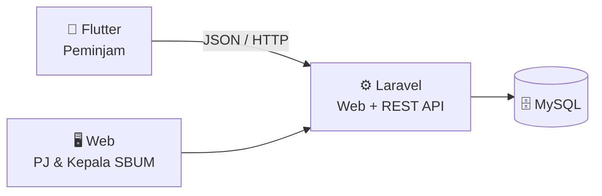

# my SBUM (Sistem Web & Mobile)

my SBUM adalah sistem informasi **Sub Bagian Umum (SBUM)** untuk proses peminjaman fasilitas, monitoring, dan pengelolaan data melalui aplikasi web dan mobile.

> **Web** untuk Penanggung Jawab & Kepala SBUM <br>
> **Mobile** untuk Peminjam

---

## Architecture



Laravel menjadi pusat backend dan menyediakan API yang digunakan oleh aplikasi Flutter.

---

## Stack

|                 | Technology       |
| --------------- | ---------------- |
| Backend & Web   | **Laravel**      |
| Mobile          | **Flutter**      |
| Database        | **MySQL**        |
| API             | **REST / JSON**  |
| Version Control | **Git + GitHub** |

---

## Repository

```text
sbum-system/
├── backend/     # Laravel
├── mobile/      # Flutter
├── docs/        # Dokumentasi proyek
├── .gitignore
└── README.md
```

### Branch

```text
main                  stable branch

feature/<task>        fitur baru
fix/<task>            bug fix
chore/<task>          setup / konfigurasi
docs/<task>           dokumentasi
```

> [PENTING]
> Jangan development langsung di `main`.
> Buat branch → commit → push → Pull Request → merge.

---

## Team Rules

- Pull `main` sebelum mulai ngoding.
- Satu branch untuk satu fitur.
- Jangan commit `.env`, token, password.
- Gunakan Pull Request sebelum melakukan merge ke `main`.
- Commit perubahan secara bertahap, jangan menunggu semuanya selesai dulu.

---

## Project Status

`Repository Setup` **● In Progress**

`Laravel` ○ Not Started

`Flutter` ○ Not Started

`REST API` ○ Not Started

`Core Features` ○ Not Started

---

<sub>
PBL-TRPL-303• my SBUM • Laravel & Flutter
</sub>
